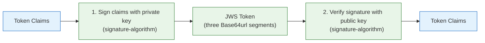
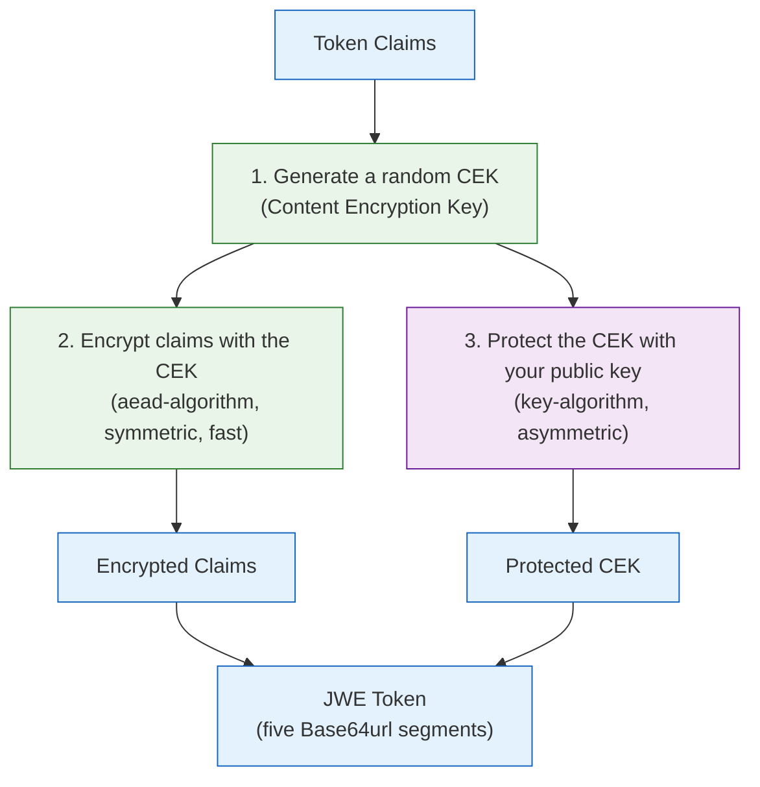
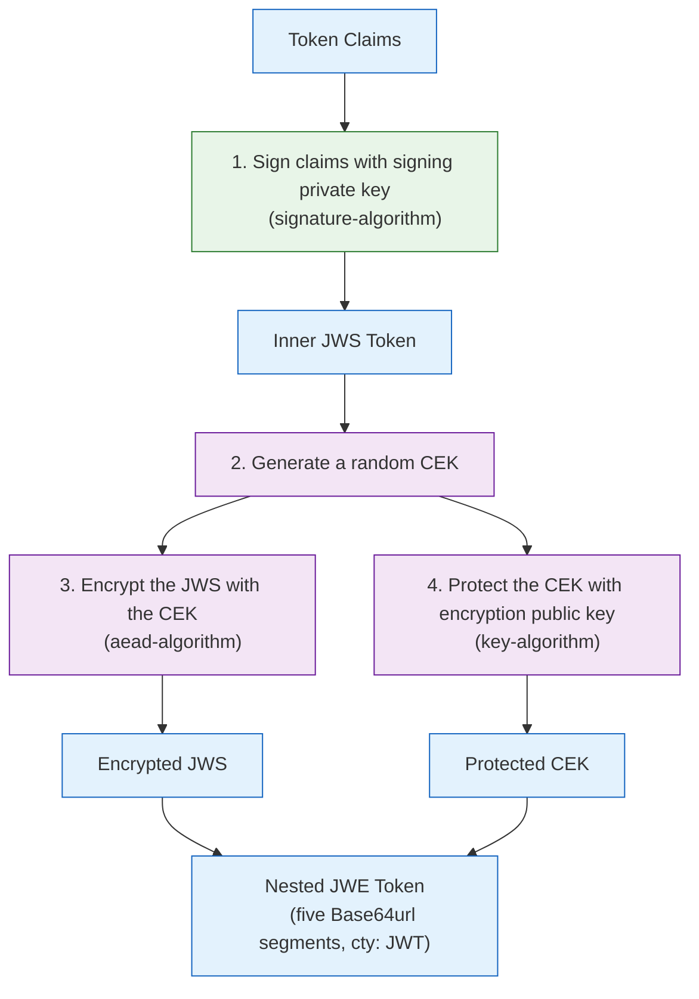

# Auth Commons

> **DEPRECATED**: This library has been split into:
>
> - [`authn-core`](https://github.com/phorus-group/authn-core): Pure Kotlin authentication library. JWT token creation, validation, and key management with zero Spring dependencies.
> - [`authn-spring-boot-starter`](https://github.com/phorus-group/authn-spring-boot-starter): Spring Boot autoconfiguration that wires authn-core as beans, plus WebFlux JWT filters, API key authentication, IdP integration, and password encoding.
>
> This library will not receive further updates. Please migrate to the replacements above.

[](https://www.apache.org/licenses/LICENSE-2.0)
[](https://mvnrepository.com/artifact/group.phorus/auth-commons)

Authentication library for Spring Boot WebFlux services. Handles token creation, token validation on
incoming requests, Identity Provider integration, and more. Add the dependency, configure `application.yml`,
and the library takes care of the rest, every authenticated request makes the current user's identity
available to your controllers and services automatically.

### Notes

> The project runs a vulnerability analysis pipeline regularly,
> any found vulnerabilities will be fixed as soon as possible.

> The project dependencies are being regularly updated by [Renovate](https://github.com/phorus-group/renovate).
> Dependency updates that don't break tests will be automatically deployed with an updated patch version.

> The project has been thoroughly tested to ensure that it is safe to use in a production environment.

## Table of contents

- [What is token-based authentication?](#what-is-token-based-authentication)
- [Features](#features)
- [Getting started](#getting-started)
  - [Installation](#installation)
  - [Quick start](#quick-start)
- [How it works](#how-it-works)
  - [Reading the authenticated user](#reading-the-authenticated-user)
- [Core concepts](#core-concepts)
  - [Token formats](#token-formats)
    - [Message-Level Encryption (MLE)](#message-level-encryption-mle)
  - [Identity Providers (IdPs)](#identity-providers-idps)
  - [Privileges](#privileges)
- [Authentication modes](#authentication-modes)
  - [STANDALONE](#standalone-default)
  - [IDP_BRIDGE](#idp_bridge)
  - [IDP_DELEGATED](#idp_delegated)
- [IdP provider setup](#idp-provider-setup)
- [API key authentication](#api-key-authentication)
  - [Static keys](#static-keys)
  - [Custom API key validator](#custom-api-key-validator)
  - [Reading API key identity](#reading-api-key-identity)
  - [Dual authentication (token + API key)](#dual-authentication-token--api-key)
- [More examples](#more-examples)
  - [Refresh tokens](#refresh-tokens)
  - [Custom properties in tokens](#custom-properties-in-tokens)
  - [Custom validators](#custom-validators)
  - [Reading HTTP request metadata](#reading-http-request-metadata)
  - [Manual token validation](#manual-token-validation)
  - [Password encoding](#password-encoding)
  - [Path filtering modes](#path-filtering-modes)
  - [Privilege gates](#privilege-gates)
  - [Disabling filters](#disabling-filters)
- [Metrics](#metrics)
- [Configuration reference](#configuration-reference)
- [Keys and algorithms](#keys-and-algorithms)
  - [Token format](#token-format)
  - [Key type](#key-type)
  - [How token protection works](#how-token-protection-works)
    - [How JWS works (signing)](#how-jws-works-signing)
    - [How JWE works (encryption)](#how-jwe-works-encryption)
    - [How nested JWE works (signing + encryption)](#how-nested-jwe-works-signing-encryption)
  - [Encryption algorithm reference](#encryption-algorithm-reference)
    - [Content encryption (aead-algorithm)](#content-encryption-aead-algorithm)
    - [Key protection for EC keys (key-algorithm)](#key-protection-for-ec-keys-key-algorithm)
    - [Key protection for RSA keys (key-algorithm)](#key-protection-for-rsa-keys-key-algorithm)
  - [Configuring and generating keys](#configuring-and-generating-keys)
    - [EC keys (default)](#ec-keys-default)
    - [RSA keys](#rsa-keys)
    - [EdDSA keys](#eddsa-keys)
- [Security considerations](#security-considerations)
- [Standards references](#standards-references)
- [Building and contributing](#building-and-contributing)
- [Authors and acknowledgment](#authors-and-acknowledgment)

***

## What is token-based authentication?

If you are already familiar with JWT-based authentication, feel free to skip to [Features](#features).

<details open>
<summary><b>Tokens and claims</b></summary>

When a user logs into your service, they prove their identity (e.g. with a username and password). After
that, you don't want them to send their password with every single request. Instead, your service creates
a **token**, a string that represents "this user already proved who they are". The client stores this token
and sends it back in every subsequent request via the `Authorization` header.

A token contains **claims**, pieces of information embedded inside it. Common claims include:

- **Subject (sub)**: who the user is (usually their ID)
- **Issuer (iss)**: who created the token (your service or an Identity Provider)
- **Expiration (exp)**: when the token stops being valid
- **Privileges/scopes**: what the user is allowed to do

The standard format for these tokens is **JWT** (JSON Web Token). A JWT encodes the claims as JSON,
then either signs, encrypts, or both signs and encrypts the result into a compact string that can be
sent as an HTTP header.

</details>

<details>
<summary><b>The request flow</b></summary>

A typical token-based authentication flow looks like this:

1. The client sends a login request with credentials (e.g. `POST /auth/login` with email and password)
2. The server verifies the credentials, creates a token containing the user's ID and privileges, and returns it
3. For every subsequent request, the client includes the token in the `Authorization` header:
   `Authorization: Bearer <token>`
4. The server reads the header, validates the token (checks the signature, expiration, etc.),
   extracts the user's identity from the claims, and proceeds with the request
5. If the token is invalid or missing, the server returns a `401 Unauthorized` response

This library automates steps 3-5 for you. You only need to implement step 2 (the login endpoint)
and configure step 1 (which paths don't require authentication).

</details>

## Features

- **Multi-format tokens**: signed (JWS), encrypted (JWE), or signed-then-encrypted (nested JWE)
- **Three authentication modes**: standalone token management, IdP bridge, and IdP delegated
- **Identity Provider compatibility**: Auth0, Azure AD / Entra ID, Google / Firebase, Keycloak, Okta, and any OIDC-compliant provider
- **IdP encrypted token support**: auto-detects and decrypts JWE and nested JWE tokens from IdPs
- **Auto-detection**: accepts tokens in any format regardless of the configured creation format
- **Refresh tokens**: long-lived tokens for session renewal with path-based restriction
- **Custom token properties**: embed arbitrary key-value pairs as JWT claims
- **API key authentication**: optional API key filter with static keys or a custom validator, runs alongside or instead of token auth
- **Multi-filter architecture**: independent token and API key filters with per-filter path filtering, composable and extensible
- **Pluggable validators**: custom claim validation via the `Validator` interface, custom API key validation via the `ApiKeyValidator` interface
- **HTTP request metadata**: capture request path, method, headers, and remote IP via `HTTPContext`
- **Nested claim extraction**: supports dot notation for extracting nested JSON claims (e.g. `realm_access.roles`)
- **Path filtering modes**: per-filter `ignored-paths` (skip listed) or `protected-paths` (only filter listed), with optional HTTP method constraints
- **Privilege gates**: require specific JWT privileges for configured paths, applied after authentication. Returns 403 Forbidden if the user holds none of the required privileges. OR within a gate's list; AND across multiple gates for the same path.
- **Optional metrics**: authentication duration timers via [metrics-commons](https://github.com/phorus-group/metrics-commons), enabled by default when Actuator is present
- **Coroutine-native**: the authenticated user is available anywhere in your request handling code
- **Password encoding**: autoconfigured SCrypt password encoder

## Getting started

### Installation

Make sure that `mavenCentral` (or any of its mirrors) is added to the repository list of the project.

Binaries and dependency information for Maven and Gradle can be found at [http://search.maven.org](https://search.maven.org/search?q=g:group.phorus%20AND%20a:auth-commons).

<details open>
<summary>Gradle / Kotlin DSL</summary>

```kotlin
implementation("group.phorus:auth-commons:x.y.z")
```
</details>

<details open>
<summary>Maven</summary>

```xml
<dependency>
    <groupId>group.phorus</groupId>
    <artifactId>auth-commons</artifactId>
    <version>x.y.z</version>
</dependency>
```
</details>

**Exception handling:** This library throws `Unauthorized` exceptions when authentication fails
(invalid token, expired token, missing authorization header, etc.). These exceptions are
automatically converted to HTTP 401 responses if you also include the
[exception-handling](https://github.com/phorus-group/exception-handling) library:

```kotlin
implementation("group.phorus:exception-handling:x.y.z")
```

Without `exception-handling`, you need to handle `Unauthorized` exceptions manually in your own
`@ControllerAdvice` or let them propagate as 500 errors.

### Quick start

This is the simplest possible setup, a service that manages its own tokens (standalone mode).

**1. Configure `application.yml`**

You need an issuer name and cryptographic keys for signing.
See [Configuring and generating keys](#configuring-and-generating-keys) for how to generate the keys.

```yaml
group:
  phorus:
    security:
      mode: STANDALONE
      filters:
        token:
          enabled: true
          refresh-token-path: /auth/token
          ignored-paths:
            - path: /auth/login
      jwt:
        issuer: my-service
        token-format: JWS
        signing:
          encoded-private-key: "<your base64 signing private key>"
          encoded-public-key: "<your base64 signing public key>"
```

**2. Create a login endpoint and a protected endpoint**

```kotlin
@RestController
class AuthController(
    private val tokenFactory: TokenFactory,       // autoconfigured by the library
    private val passwordEncoder: SCryptPasswordEncoder, // autoconfigured by the library
    private val userRepository: UserRepository,
) {
    // Login: this path is in ignored-paths, so no token is required
    @PostMapping("/auth/login")
    suspend fun login(@RequestBody request: LoginRequest): AccessToken {
        val user = userRepository.findByEmail(request.email)
            ?: throw Unauthorized("Invalid credentials")
        if (!passwordEncoder.matches(request.password, user.hashedPassword))
            throw Unauthorized("Invalid credentials")

        return tokenFactory.createAccessToken(user.id, user.privileges)
    }

    // Protected: requires a valid token in the Authorization header
    @GetMapping("/me")
    suspend fun me(): UserProfile {
        val auth = AuthContext.context.get()  // the authenticated user
        return userRepository.findById(auth.userId).toProfile()
    }
}
```

**3. The request flow in practice**

```
POST /auth/login                           -> no token needed (ignored path)
  Request:  { "email": "a@b.com", "password": "secret" }
  Response: { "token": "eyJhbGci"..., "privileges": ["read", "write"] }

GET /me                                    -> token required
  Header:   Authorization: Bearer eyJhbGci...
  Response: { "id": ""..., "name": "Alice", "email": "a@b.com" }

GET /me (without token)                    -> 401 Unauthorized
  Response: { "message": "Authorization header is missing or invalid" }
```

That's it. The library handles token validation and claim extraction automatically. Error responses
are automatic only if you include the `exception-handling` library (see [Installation](#installation)).

## How it works

Here is what happened behind the scenes in the quick start example:

1. **`POST /auth/login`** matched the `ignored-paths` configuration, so the library let the request
   through without requiring a token. Your code verified the credentials and used `TokenFactory`
   to create a token. The token contains the user's ID and privileges as signed and encrypted claims.

2. **`GET /me`** did not match any ignored path, so the library's `AuthFilter` intercepted it:
   - It extracted the token from the `Authorization: Bearer <token>` header
   - It auto-detected the token format and validated it
   - It checked that the token was not expired and that the issuer matched
   - It extracted the user's ID, privileges, and any custom properties from the claims
   - It ran all registered `Validator` beans to perform custom claim validation (if any)
   - It made that information available to your code as an `AuthContextData` object

3. Your controller called `AuthContext.context.get()` to read the authenticated user's data
   and used `auth.userId` to look up the user profile.

If the token is missing, expired, tampered with, or otherwise invalid, the filter returns a
`401 Unauthorized` response and your controller code is never reached.

### Reading the authenticated user

There are two ways to access the authenticated user's data in your code:

**Option 1: `AuthContext.context.get()`**

Works anywhere in your request handling code, controllers, services, repositories, or any function
called during request processing. This is the most common approach.

```kotlin
// In a controller
@GetMapping("/me")
suspend fun me(): UserProfile {
    val auth = AuthContext.context.get()
    return userService.getProfile(auth.userId)
}

// In a service (no need to pass auth data as a parameter)
@Service
class OrderService {
    suspend fun placeOrder(order: OrderRequest): Order {
        val auth = AuthContext.context.get()
        return orderRepository.save(Order(userId = auth.userId, items = order.items))
    }
}
```

**Option 2: `@RequestHeader` parameter injection**

Spring can automatically convert the `Authorization` header into an `AuthContextData` object
in your controller method signature. This is useful when you prefer explicit parameter passing:

```kotlin
@GetMapping("/me")
suspend fun me(
    @RequestHeader(HttpHeaders.AUTHORIZATION) auth: AuthContextData,
): UserProfile {
    return userService.getProfile(auth.userId)
}
```

Both approaches give you an `AuthContextData` object with the same fields:

| Field | Type | Description |
|-------|------|-------------|
| `userId` | `UUID` | The authenticated user's identifier |
| `privileges` | `List<String>` | The user's roles, permissions, or scopes |
| `properties` | `Map<String, String>` | Any custom claims embedded in the token |

***

## Core concepts

### Token formats

When the library creates a token, it can protect the claims in three different ways:

<details open>
<summary><b>JWS, JWE, and nested JWE</b></summary>

| Format | What it does | Trade-offs |
|--------|-------------|------------|
| **JWS** (signed) | Signs the claims so nobody can tamper with them, but anyone can read them | Integrity + authenticity. Claims visible (base64 encoded). Widely used by OAuth 2.0 IdPs. |
| **JWE** (encrypted) | Encrypts the claims so nobody can read them, but there is no signature | Confidentiality only. No integrity guarantee without additional mechanisms. |
| **Nested JWE** (signed + encrypted) | Signs the claims first, then encrypts the signed result | Both integrity and confidentiality. Higher overhead (encrypt + decrypt + verify). |

**When to use each format:**

- **JWS** is sufficient when claims do not contain sensitive data and you only need to verify that
  the token was not tampered with. This is the most common format for access tokens that carry
  user IDs and roles.
- **JWE** is useful when token claims contain sensitive data (personal identifiers, internal
  metadata) and confidentiality is required, but the token is only consumed by systems that share
  the encryption key.
- **Nested JWE** provides both confidentiality and integrity. It is used in environments where
  tokens pass through intermediaries (proxies, gateways, message queues) and must remain both
  unreadable and tamper-proof. This is also the format used by IdPs that implement
  [Message-Level Encryption (MLE)](#message-level-encryption-mle).

The token format is configured via `jwt.token-format` and only affects how the library **creates**
tokens. When **validating** incoming tokens, the library auto-detects the format, so a service can
accept tokens created by a previous deployment that used a different format.

For detailed diagrams and step-by-step breakdowns of how each format works internally, see
[How token protection works](#how-token-protection-works).

</details>

#### Message-Level Encryption (MLE)

<details>
<summary><b>What is MLE and when is it used?</b></summary>

Message-Level Encryption (MLE) is a security pattern where the token payload is encrypted at the
application level, independent of transport security (HTTPS/TLS). With MLE, even if TLS is
terminated at a load balancer, CDN, or API gateway, the token contents remain encrypted and
unreadable to those intermediaries.

**How it works:** the token issuer encrypts the payload using the recipient's public key. Only the
recipient, who holds the corresponding private key, can decrypt and read the contents. When
combined with a signature (nested JWE), the recipient can also verify that the contents were not
modified.

**Advantages over transport-only security:**

- **End-to-end confidentiality**: token contents are protected even when TLS terminates at an
  intermediary (reverse proxy, API gateway, CDN) before reaching your service.
- **Defense in depth**: adds a second layer of protection if TLS is misconfigured, downgraded,
  or compromised.
- **Auditability without exposure**: intermediaries can log and route tokens without being able
  to read their contents.

**Common use cases:**

- IdPs that require MLE for regulatory compliance (e.g. financial services, eIDAS, PSD2).
- Architectures where tokens pass through untrusted intermediaries.
- Systems handling tokens that contain personally identifiable information (PII).

In the context of this library, MLE applies in two scenarios:

1. **IdP tokens**: some IdPs send nested JWE tokens. Configure `idp.encryption.encoded-private-key`
   so the library can decrypt them before verifying the inner signature.
2. **Self-issued tokens**: in standalone mode, setting `jwt.token-format: NESTED_JWE` creates
   tokens that follow the same sign-then-encrypt pattern.

</details>

### Identity Providers (IdPs)

<details>
<summary><b>What is an Identity Provider?</b></summary>

An Identity Provider (IdP) is a third-party service that manages user accounts and handles
authentication on your behalf. Examples include Auth0, Azure AD / Entra ID, Google, Keycloak,
and Okta.

You delegate authentication to the IdP. The IdP authenticates the user and issues a token
that your service can validate, eliminating the need to manage credentials and authentication logic
in your application.

The library auto-detects the IdP token format:

- **JWS** (signed): signature verified using the IdP's JWKS public keys.
- **JWE** (encrypted): decrypted using your configured private key.
- **Nested JWE** (signed then encrypted): decrypted first, then the inner JWS signature is
  verified via JWKS. Some IdPs use this for [Message-Level Encryption (MLE)](#message-level-encryption-mle).

JWE and nested JWE require configuring `idp.encryption.encoded-private-key` with a private key
whose corresponding public key is registered with the IdP.

The library supports two ways of working with an IdP:

- **IdP bridge** (`IDP_BRIDGE`): the IdP handles the initial login, but your service creates its
  own tokens afterward. This is useful when you want to enrich the token with extra data from
  your database.
- **IdP delegated** (`IDP_DELEGATED`): the IdP handles everything, including token creation and
  refresh. Your service only validates the IdP's tokens. This is the simplest setup.

Both modes use the IdP's JWKS public keys to verify token signatures (for JWS and nested JWE).
The library fetches and caches these keys automatically.

See [Authentication modes](#authentication-modes) for full configuration and code examples.

</details>

### Privileges

<details>
<summary><b>What are privileges and where do they come from?</b></summary>

Privileges are a list of strings that describe what the user is allowed to do. They are stored
inside the token as a claim and extracted by the library into `AuthContextData.privileges`.

```kotlin
val auth = AuthContext.context.get()
if ("admin" in auth.privileges) {
    // user has admin access
}
```

**auth-commons does not manage where privileges come from.** It only reads them from the token.
Whoever creates the token is responsible for putting the right privileges in it.

- In **standalone mode**, your service creates the tokens, so you decide what privileges to include
  (e.g. from your database).
- In **IdP modes**, the IdP embeds privileges in the token. Different IdPs call them different
  things: `scope`, `scp`, `permissions`, `roles`, `groups`, etc.
  The `idp.claims.privileges` configuration property tells the library which claim name to read.

</details>

## Authentication modes

The library supports three modes that control how tokens are created and validated. Pick the one
that matches your architecture.

### `STANDALONE` (default)

**When to use:** your service manages its own user accounts and does not use an external login service.

Your service creates tokens (via `TokenFactory`) when users log in and validates them (via the
auth filter) on every subsequent request. No external IdP is involved.

In this mode, the library autowires `TokenFactory` and `Authenticator` as Spring beans. The auth
filter uses `Authenticator` to validate tokens on every request, checking the signature and
decryption using the keys you configured in `jwt.signing.*` and `jwt.encryption.*`. Since there
is no IdP integration, `IdpAuthenticator` and `JwksKeyLocator` are not created.

<details open>
<summary><b>Configuration</b></summary>

```yaml
group:
  phorus:
    security:
      mode: STANDALONE
      filters:
        token:
          enabled: true
          refresh-token-path: /auth/token
          ignored-paths:
            - path: /auth/login
            - path: /user
              method: POST        # only POST is ignored, GET /user still requires auth
      jwt:
        issuer: my-service
        token-format: JWS
        signing:
          encoded-private-key: "<base64 PKCS#8 private key>"
          encoded-public-key: "<base64 X.509 public key>"
        expiration:
          token-minutes: 10
          refresh-token-minutes: 1440
```

Key configuration points:
- **`ignored-paths`**: requests matching these paths bypass authentication entirely. You can
  optionally restrict by HTTP method (e.g. only `POST /user` is public, but `GET /user` requires auth).
- **`protected-paths`**: the inverse of `ignored-paths`. Only the listed paths require authentication;
  everything else is skipped. Only one of `ignored-paths` or `protected-paths` may be used per filter.
- **`refresh-token-path`**: the only path that accepts refresh tokens. All other paths reject them.
- **`token-format`**: how the library creates tokens. Defaults to `JWS` (see [Token formats](#token-formats)).
- **`expiration`**: access tokens default to 10 minutes, refresh tokens to 24 hours.

</details>

<details>
<summary><b>Code example</b></summary>

```kotlin
@RestController
class AuthController(
    private val tokenFactory: TokenFactory,
    private val userService: UserService,
) {
    @PostMapping("/auth/login")
    suspend fun login(@RequestBody request: LoginRequest): AccessToken {
        val user = userService.verifyCredentials(request.email, request.password)
        return tokenFactory.createAccessToken(user.id, user.privileges)
    }

    @GetMapping("/me")
    suspend fun me(): UserProfile {
        val auth = AuthContext.context.get()
        return userService.getProfile(auth.userId)
    }

    @PostMapping("/auth/token")
    suspend fun refresh(): AccessToken {
        val auth = AuthContext.context.get()
        return tokenFactory.createAccessToken(auth.userId, auth.privileges)
    }
}
```

</details>

### `IDP_BRIDGE`

**When to use:** you use an external IdP for login (Auth0, Keycloak, etc.) but want to create your
own tokens internally. Common reasons: you need encrypted tokens (most IdPs only issue signed
tokens), you want to enrich the token with data from your database, or you want a consistent
token format across multiple IdPs.

Your service receives the IdP token, validates it using `IdpAuthenticator`, extracts the user
identity, and creates its own token. From that point on, the client uses your service's token
for all subsequent requests.

In this mode, the library autowires `TokenFactory`, `IdpAuthenticator`, and `JwksKeyLocator` as
Spring beans. `JwksKeyLocator` fetches the IdP's public keys from the JWKS endpoint and caches
them. You manually inject `IdpAuthenticator` in your bridge endpoint to validate the incoming IdP
token. If the IdP sends encrypted tokens, `IdpAuthenticator` decrypts them first using the private
key you configured in `idp.encryption.*`, then verifies the signature using the public keys from
`JwksKeyLocator`. After extracting the user identity, you use `TokenFactory` to create your own
token. The auth filter then uses `Authenticator` (not `IdpAuthenticator`) to validate all
subsequent requests, since those requests carry your service's tokens, not IdP tokens.

How the backend obtains the IdP token depends on the OAuth 2.0 flow:

- **Authorization code flow** (most common for web applications): the frontend redirects the user
  to the IdP. After login, the IdP redirects back with an authorization code. The frontend sends
  this code to your backend, which exchanges it for a token at the IdP's token endpoint. The
  exchange is done by your code (e.g. using `WebClient`); auth-commons handles only the
  validation step afterward.
- **Direct token flow** (common with native SDKs and SPAs using PKCE): the client obtains the
  token directly from the IdP (e.g. via Firebase Auth, Google Sign-In, or a PKCE flow). The
  client then sends the token to your backend for validation.

<details open>
<summary><b>Configuration</b></summary>

```yaml
group:
  phorus:
    security:
      mode: IDP_BRIDGE
      filters:
        token:
          enabled: true
          refresh-token-path: /auth/token
          ignored-paths:
            - path: /auth/bridge
      jwt:
        issuer: my-service
        token-format: JWS
        signing:
          encoded-private-key: "<base64 PKCS#8 private key>"
          encoded-public-key: "<base64 X.509 public key>"
      idp:
        issuer-uri: https://your-idp.example.com
        jwk-set-uri: https://your-idp.example.com/.well-known/jwks.json
        claims:
          subject: sub
          privileges: permissions
```

This requires both sets of configuration: `jwt.*` for creating your own tokens, and `idp.*` for
validating the IdP's tokens during the bridge step.

</details>

<details>
<summary><b>Code example: authorization code flow</b></summary>

The frontend sends the authorization code it received from the IdP callback. The backend
exchanges it for a token, validates it, and creates its own token.

```kotlin
@RestController
class BridgeAuthController(
    private val idpAuthenticator: IdpAuthenticator,
    private val tokenFactory: TokenFactory,
    private val userService: UserService,
    private val webClient: WebClient,
    private val securityConfiguration: SecurityConfiguration,
) {
    @PostMapping("/auth/bridge")
    suspend fun bridgeLogin(@RequestBody request: CodeExchangeRequest): AccessToken {
        // Exchange the authorization code for an IdP token
        val idpToken = exchangeCodeForToken(request.code, request.redirectUri)

        // Validate the IdP token and extract claims
        val idpData = idpAuthenticator.authenticate(idpToken)

        // Optionally enrich with data from your database
        val user = userService.findOrCreate(idpData.userId, idpData.privileges)
        return tokenFactory.createAccessToken(user.id, user.privileges, idpData.properties)
    }

    private suspend fun exchangeCodeForToken(code: String, redirectUri: String): String {
        val idp = securityConfiguration.idp
        val response = webClient.post()
            .uri(idp.tokenUri!!)
            .bodyValue(
                mapOf(
                    "grant_type" to "authorization_code",
                    "code" to code,
                    "redirect_uri" to redirectUri,
                    "client_id" to idp.clientId!!,
                    "client_secret" to idp.clientSecret!!,
                )
            )
            .retrieve()
            .bodyToMono(TokenResponse::class.java)
            .awaitSingle()

        return response.idToken ?: response.accessToken
    }

    @GetMapping("/me")
    suspend fun me(): UserProfile {
        val auth = AuthContext.context.get()
        return userService.getProfile(auth.userId)
    }
}
```

</details>

<details>
<summary><b>Code example: direct token flow</b></summary>

The client already has the IdP token (e.g. from a native SDK like Firebase Auth or Google
Sign-In). It sends the token directly to the backend.

```kotlin
@RestController
class BridgeAuthController(
    private val idpAuthenticator: IdpAuthenticator,
    private val tokenFactory: TokenFactory,
    private val userService: UserService,
) {
    @PostMapping("/auth/bridge")
    suspend fun bridgeLogin(@RequestBody idpToken: String): AccessToken {
        val idpData = idpAuthenticator.authenticate(idpToken)

        val user = userService.findOrCreate(idpData.userId, idpData.privileges)
        return tokenFactory.createAccessToken(user.id, user.privileges, idpData.properties)
    }

    @GetMapping("/me")
    suspend fun me(): UserProfile {
        val auth = AuthContext.context.get()
        return userService.getProfile(auth.userId)
    }
}
```

</details>

### `IDP_DELEGATED`

**When to use:** you use an external IdP and are happy with its tokens as-is. This is the simplest
IdP setup. Your service never creates tokens. Token refresh is handled entirely by the IdP on the
client side.

The client authenticates with the IdP using any standard OAuth 2.0 flow (authorization code with
PKCE, device authorization, client credentials, etc.) and obtains tokens directly from the IdP.
The client then includes the IdP token in the `Authorization: Bearer <token>` header on every
request to your service.

In this mode, the library autowires `IdpAuthenticator` and `JwksKeyLocator` as Spring beans.
`JwksKeyLocator` fetches the IdP's public keys from the JWKS endpoint and caches them.
The auth filter uses `IdpAuthenticator` (not `Authenticator`) to validate every
incoming request. It verifies the token signature using the public keys from `JwksKeyLocator`. If
the IdP sends encrypted tokens, the filter decrypts them first using the private key you
configured in `idp.encryption.*`. Since your service never creates its own tokens, `TokenFactory`
is not needed and you do not configure `jwt.signing.*` or `jwt.encryption.*`.

<details open>
<summary><b>Configuration</b></summary>

```yaml
group:
  phorus:
    security:
      mode: IDP_DELEGATED
      filters:
        token:
          enabled: true
          ignored-paths:
            - path: /public/**
      idp:
        issuer-uri: https://your-idp.example.com
        jwk-set-uri: https://your-idp.example.com/.well-known/jwks.json
        claims:
          subject: sub
          privileges: scope
```

No `jwt.*` configuration is needed since the service does not create tokens.

</details>

<details>
<summary><b>Code example</b></summary>

```kotlin
@RestController
class ApiController(
    private val itemService: ItemService,
) {
    @GetMapping("/items")
    suspend fun listItems(): List<Item> {
        val auth = AuthContext.context.get()
        return itemService.getItemsForUser(auth.userId)
    }

    @PostMapping("/items")
    suspend fun createItem(@RequestBody request: CreateItemRequest): Item {
        val auth = AuthContext.context.get()
        require("items:write" in auth.privileges) { "Insufficient privileges" }
        return itemService.create(auth.userId, request)
    }
}
```

</details>

## IdP provider setup

When using `IDP_BRIDGE` or `IDP_DELEGATED` mode, the `idp.claims.*` properties control how the
IdP's token claims are mapped to the library's internal representation. Different providers use
different claim names for the user identifier and privileges.

If the IdP sends encrypted tokens (JWE or nested JWE), add the `idp.encryption` block with
your private key. The library auto-detects the token format at parse time.

<details>
<summary><b>Auth0</b></summary>

```yaml
group.phorus.security.idp:
  issuer-uri: https://your-tenant.auth0.com/
  jwk-set-uri: https://your-tenant.auth0.com/.well-known/jwks.json
  claims:
    subject: sub             # format: "auth0|abc123"
    privileges: permissions  # or "scope" for OIDC scopes
```
</details>

<details>
<summary><b>Azure AD / Entra ID</b></summary>

```yaml
group.phorus.security.idp:
  issuer-uri: https://login.microsoftonline.com/{tenant-id}/v2.0
  jwk-set-uri: https://login.microsoftonline.com/{tenant-id}/discovery/v2.0/keys
  claims:
    subject: oid             # Azure AD uses "oid" for user object ID
    privileges: roles        # or "scp" for delegated permissions
```
</details>

<details>
<summary><b>Google / Firebase</b></summary>

```yaml
group.phorus.security.idp:
  issuer-uri: https://securetoken.google.com/{project-id}
  jwk-set-uri: https://www.googleapis.com/oauth2/v3/certs
  claims:
    subject: sub
    privileges: scope
```
</details>

<details>
<summary><b>Keycloak</b></summary>

```yaml
group.phorus.security.idp:
  issuer-uri: https://keycloak.example.com/realms/{realm}
  jwk-set-uri: https://keycloak.example.com/realms/{realm}/protocol/openid-connect/certs
  claims:
    subject: sub
    privileges: realm_access.roles   # dot-notation for nested claims
```
</details>

<details>
<summary><b>Okta</b></summary>

```yaml
group.phorus.security.idp:
  issuer-uri: https://your-domain.okta.com/oauth2/{server-id}
  jwk-set-uri: https://your-domain.okta.com/oauth2/{server-id}/v1/keys
  claims:
    subject: sub
    privileges: scp          # or "groups"
```
</details>

<details>
<summary><b>IdP with encrypted tokens (MLE)</b></summary>

If the IdP sends JWE or nested JWE tokens, add the encryption configuration. The corresponding
public key must be registered with the IdP so it can encrypt tokens for your service.

```yaml
group.phorus.security.idp:
  issuer-uri: https://idp.example.com
  jwk-set-uri: https://idp.example.com/.well-known/jwks.json
  claims:
    subject: sub
    privileges: scope
  encryption:
    algorithm: RSA                              # or "EC", must match the key type
    encoded-private-key: "<base64 PKCS#8 private key>"
```
</details>

***

## API key authentication

The library includes an optional API key filter that runs alongside (or instead of) token
authentication. It extracts an API key from a configurable HTTP header, validates it, and makes
the key identity available to your code via `ApiKeyContext`.

Common use cases:
- **Webhook receivers**: external services call your endpoint with a pre-shared API key
- **Internal service-to-service calls**: services authenticate with API keys instead of tokens
- **Mixed authentication**: some endpoints require a token, some require an API key, some require both.
  Tokens identify who is calling, while API keys act as an additional access gate. For example,
  requiring both ensures the caller is authenticated and that only an authorized service like a BFF
  can reach the endpoint on their behalf

### Static keys

<details open>
<summary><b>Configuring API keys in application.yml</b></summary>

The simplest setup uses static keys defined in configuration. Each key has a name (or id)
and a value (the secret). The filter compares the header value against all configured values using
constant-time comparison to prevent timing attacks, and resolves the matching key name.

```yaml
group:
  phorus:
    security:
      filters:
        api-key:
          enabled: true
          header: X-API-KEY              # default, can be changed
          keys:
            default: ${API_KEY}          # name: "default", value from env var
            partner-a: ${PARTNER_A_KEY}  # name: "partner-a"
            partner-b: ${PARTNER_B_KEY}  # name: "partner-b"
          ignored-paths:
            - path: /actuator/**
            - path: /swagger-ui/**
```

When a request arrives with `X-API-KEY: <value>` and the value matches `PARTNER_A_KEY`, the request will be accepted, 
and `ApiKeyContext` will contain `keyId = "partner-a"`.

</details>

### Custom API key validator

<details>
<summary><b>Dynamic validation with the ApiKeyValidator interface</b></summary>

For dynamic validation (database lookup, external service call, key rotation, etc.), implement
the `ApiKeyValidator` interface and register it as a Spring bean. The filter tries static keys
first, then falls back to the custom validator if no static key matched. Both can be used
together, or you can use either one on its own.

```kotlin
@Service
class DatabaseApiKeyValidator(
    private val apiKeyRepository: ApiKeyRepository,
) : ApiKeyValidator {
    override fun validate(apiKey: String, request: ServerHttpRequest?): ApiKeyValidationResult {
        val entity = apiKeyRepository.findByKeyHash(hash(apiKey))
            ?: return ApiKeyValidationResult(valid = false)

        if (entity.revoked) return ApiKeyValidationResult(valid = false)

        return ApiKeyValidationResult(
            valid = true,
            keyId = entity.name,
            metadata = mapOf("ownerId" to entity.ownerId.toString()),
        )
    }
}
```

The `request` parameter gives you access to the full incoming HTTP request, including the path, method, headers, query
parameters, etc., so you can make validation decisions based on the request context. For example, to
restrict a key to a specific path prefix:

```kotlin
override fun validate(apiKey: String, request: ServerHttpRequest): ApiKeyValidationResult {
    val entity = apiKeyRepository.findByKey(apiKey)
        ?: return ApiKeyValidationResult(valid = false)

    // Restrict this key to webhook endpoints only
    if (!request.path.value().startsWith("/webhooks")) {
        return ApiKeyValidationResult(valid = false)
    }

    return ApiKeyValidationResult(valid = true, keyId = entity.name)
}
```

The `metadata` map is stored in `ApiKeyContextData.metadata` and can carry any extra information
about the key (owner, scopes, rate limit tier, etc.).

**Security note**: When implementing the validator for database or cache lookups, use constant-time
comparison (e.g. `MessageDigest.isEqual()`) to compare stored API keys with the provided key.
This prevents timing attacks where an attacker could measure response times to progressively
guess the key.

**Performance note**: You probably don't want to make database lookups for every request. The example
shows a simple implementation for illustration purposes. In a production system, you would want to
implement caching or other optimization strategies.

</details>

### Reading API key identity

<details>
<summary><b>Using ApiKeyContext in controllers and services</b></summary>

After successful API key authentication, the key identity is available via
`ApiKeyContext.context.get()`, similar to how `AuthContext` works for token authentication.

```kotlin
@RestController
class WebhookController {
    @PostMapping("/webhook/callback")
    suspend fun handleCallback(@RequestBody payload: WebhookPayload) {
        val apiKey = ApiKeyContext.context.get()
        println("Callback from: ${apiKey.keyId}")        // e.g. "partner-a"
        println("Owner: ${apiKey.metadata["ownerId"]}")    // from custom validator
    }
}
```

Alternatively, you can use `@RequestHeader` parameter injection to convert the raw header
value into `ApiKeyContextData` directly:

```kotlin
@PostMapping("/webhook/callback")
suspend fun handleCallback(
    @RequestHeader("X-API-KEY") apiKey: ApiKeyContextData,
    @RequestBody payload: WebhookPayload,
) {
    println("Callback from: ${apiKey.keyId}")
}
```

**Note**: using @RequestHeader to getthe apiKey is *not* compatible with a custom ApiKeyValidator
that requires the ServerHttpRequest to function. If you need this, use the ApiKeyContext aproach instead.

`ApiKeyContextData` has two fields:

| Field | Type | Description |
|-------|------|-------------|
| `keyId` | `String?` | The resolved identifier (map key for static keys, or from the validator) |
| `metadata` | `Map<String, String>` | Extra key-value data from the validator (empty for static keys) |

</details>

### Dual authentication (token + API key)

<details>
<summary><b>Requiring both API key and JWT token on the same endpoint</b></summary>

When both filters are enabled, a request must satisfy **all** active filters unless the request
path is skipped by that filter's path filtering configuration (`ignored-paths` or `protected-paths`).
This gives you fine-grained control:

```yaml
group:
  phorus:
    security:
      mode: STANDALONE
      filters:
        token:
          enabled: true
          refresh-token-path: /auth/token
          ignored-paths:
            - path: /auth/login
            - path: /webhook/**       # webhooks don't need JWT
        api-key:
          enabled: true
          keys:
            webhook-partner: ${WEBHOOK_KEY}
          ignored-paths:
            - path: /auth/**          # auth endpoints don't need API key
            - path: /api/**           # normal API endpoints don't need API key
      jwt:
        issuer: my-service
        # ... signing config
```

With this configuration:

| Path | Token ignored? | API key ignored? | Required |
|------|---------------|-----------------|----------|
| `/auth/login` | Yes | Yes | Nothing (public) |
| `/api/items` | No | Yes | JWT token only |
| `/webhook/callback` | Yes | No | API key only |
| `/admin/dashboard` | No | No | Both JWT token AND API key |

In your controller, you can read both contexts:

```kotlin
@GetMapping("/admin/dashboard")
suspend fun dashboard(): DashboardData {
    val auth = AuthContext.context.get()       // JWT identity
    val apiKey = ApiKeyContext.context.get()   // API key identity
    // both are guaranteed to be populated on this path
}
```

</details>

***

## More examples

### Refresh tokens

<details>
<summary><b>What are refresh tokens and how to use them</b></summary>

Access tokens are short-lived (10 minutes by default) so that a stolen token has limited impact.
But you don't want users to log in again every 10 minutes. Refresh tokens solve this: they are
long-lived tokens (24 hours by default) that can only be used on a single endpoint to get a new
access token.

The library enforces this restriction automatically. Refresh tokens are only accepted on the path
configured in `refresh-token-path`. Any other path rejects them with a 401.

```kotlin
@RestController
class AuthController(
    private val tokenFactory: TokenFactory,
    private val userService: UserService,
) {
    @PostMapping("/auth/login")
    suspend fun login(@RequestBody request: LoginRequest): LoginResponse {
        val user = userService.verifyCredentials(request.email, request.password)
        val accessToken = tokenFactory.createAccessToken(user.id, user.privileges)
        val refreshToken = tokenFactory.createRefreshToken(user.id, expires = true)
        return LoginResponse(accessToken = accessToken.token, refreshToken = refreshToken)
    }

    // Client sends the refresh token in the Authorization header to this endpoint
    @PostMapping("/auth/token")
    suspend fun refresh(): AccessToken {
        val auth = AuthContext.context.get()
        return tokenFactory.createAccessToken(auth.userId, auth.privileges)
    }
}
```

The typical client flow:
1. Login: get both an access token and a refresh token
2. Use the access token for all API calls
3. When the access token expires (401 response), send the refresh token to `/auth/token`
4. Receive a new access token and continue

</details>

### Custom properties in tokens

<details>
<summary><b>Embedding and reading extra claims</b></summary>

You can embed arbitrary key-value pairs into a token at creation time. These are stored as
additional JWT claims and are available later via `AuthContextData.properties`.

```kotlin
// When creating the token, pass a properties map
val token = tokenFactory.createAccessToken(
    userId = user.id,
    privileges = user.privileges,
    properties = mapOf("deviceId" to deviceId, "tenantId" to tenantId),
)

// Later, in any controller or service handling a request with this token
val auth = AuthContext.context.get()
val tenantId = auth.properties["tenantId"]
val deviceId = auth.properties["deviceId"]
```

This is useful for multi-tenant applications, device tracking, or any scenario where you need
extra context about the authenticated session beyond the user ID and privileges.

</details>

### Custom validators

<details>
<summary><b>Adding extra validation logic to token authentication</b></summary>

Sometimes you need to run additional checks when a token is validated, beyond just verifying the
signature and expiration. For example, you might want to check if the device that created the token
has been disabled, or if the token has been explicitly revoked.

Implement the `Validator` interface and register it as a Spring bean. The library discovers all
validators automatically and invokes them during token authentication. If any validator rejects
the token, the request gets a 401 response.

```kotlin
@Service
class DeviceValidator(
    private val deviceRepository: DeviceRepository,
) : Validator {
    // Which claim does this validator inspect?
    override fun accepts(property: String): Boolean = property == Claims.ID

    // Is the claim value valid?
    override fun isValid(value: String, properties: Map<String, String>): Boolean {
        val device = deviceRepository.findByJti(value) ?: return false
        return !device.disabled
    }
}
```

The `accepts` method receives the claim name. Return `true` for the claims you want to validate.
The `isValid` method receives the claim value and all token properties. Return `false` to reject
the token.

You can register multiple validators. Each one is called for every claim it accepts.

</details>

### Reading HTTP request metadata

<details>
<summary><b>Using HTTPContext for audit trails and logging</b></summary>

In addition to authentication data, the library also captures HTTP request metadata via a separate
filter (`HTTPFilter`). This data is available via `HTTPContext.context.get()` and includes the
request path, method, headers, remote IP address, and other metadata.

```kotlin
@Service
class AuditService {
    suspend fun logAction(action: String) {
        val auth = AuthContext.context.get()
        val http = HTTPContext.context.get()
        auditRepository.save(
            AuditEntry(
                userId = auth.userId,
                action = action,
                ipAddress = http.remoteAddress,
                userAgent = http.userAgent,
                path = http.path,
            )
        )
    }
}
```

</details>

### Manual token validation

<details>
<summary><b>Validating tokens outside of the HTTP filter chain</b></summary>

The auth filter handles token validation automatically for HTTP requests. But if you need to
validate a token in a different context (e.g. a WebSocket handler, a message queue consumer,
or a scheduled task), you can inject `Authenticator` or `IdpAuthenticator` directly:

```kotlin
@Component
class WebSocketHandler(
    private val authenticator: Authenticator,
) {
    fun onConnect(token: String) {
        val authData = authenticator.authenticate(token)
        // authData.userId, authData.privileges, authData.properties
    }
}
```

</details>

### Password encoding

<details>
<summary><b>Using the autoconfigured password encoder</b></summary>

The library autoconfigures an `SCryptPasswordEncoder` bean. SCrypt is a memory-hard key
derivation function designed to make brute-force attacks expensive by requiring both CPU time
and a significant amount of memory per hash. You can tune it via
`group.phorus.security.password-encoder.*` properties:

| Property | Default | Description |
|----------|---------|-------------|
| `cpu-cost` | `8192` | CPU/memory cost parameter (N). Must be a power of 2. Higher values make hashing slower and use more memory. Each doubling roughly doubles both time and memory. Memory per hash: ~128 x cpuCost x memoryCost bytes. |
| `memory-cost` | `8` | Block size parameter (r). Controls how much data is mixed per iteration. Higher values increase memory usage per block. |
| `parallelization` | `1` | Parallelization parameter (p). Controls how many independent mixing operations run. Higher values multiply the total memory requirement. 1 (single-threaded) is standard for web applications. |
| `key-length` | `32` | Length of the derived key in bytes. 32 bytes = 256 bits, which is the standard for secure password hashing. No reason to change this unless a specific compliance requirement demands it. |
| `salt-length` | `16` | Length of the random salt in bytes. 16 bytes = 128 bits. The salt is generated randomly for each password and prevents rainbow table attacks. No reason to change this. |

The defaults provide a good balance between security and performance (~8 MB memory, ~50-100 ms
per hash). For higher security environments, increase `cpu-cost` to 16384 (~16 MB, ~100-200 ms)
or 65536 (~64 MB, ~1-2 s).

```yaml
# Production: higher security
group:
  phorus:
    security:
      password-encoder:
        cpu-cost: 16384
```

**Testing and CI/CD:** The default parameters are already lightweight, but for test environments
and CI/CD runners where password hashing happens frequently and security strength is irrelevant,
you should reduce `cpu-cost` and `memory-cost` significantly to avoid wasting resources:

```yaml
# Test profile (application-test.yml)
group:
  phorus:
    security:
      password-encoder:
        cpu-cost: 512
        memory-cost: 2
```

Inject the encoder wherever you need to hash or verify passwords:

```kotlin
@Service
class UserService(
    private val passwordEncoder: SCryptPasswordEncoder,
    private val userRepository: UserRepository,
) {
    suspend fun register(email: String, rawPassword: String): User {
        val hashedPassword = passwordEncoder.encode(rawPassword)
        return userRepository.save(User(email = email, password = hashedPassword))
    }

    suspend fun verifyCredentials(email: String, rawPassword: String): User {
        val user = userRepository.findByEmail(email)
            ?: throw Unauthorized("Invalid credentials")
        if (!passwordEncoder.matches(rawPassword, user.password))
            throw Unauthorized("Invalid credentials")
        return user
    }
}
```

</details>

### Path filtering modes

<details>
<summary><b>Controlling which paths require authentication</b></summary>

Each filter supports two mutually exclusive modes for controlling which paths require authentication.
Only one may be configured per filter; setting both causes the application to **fail at startup** with an `IllegalArgumentException`.

**`ignored-paths`** (default approach): all paths require authentication **except** the listed ones.

```yaml
group:
  phorus:
    security:
      filters:
        token:
          enabled: true
          ignored-paths:
            - path: /auth/login
            - path: /catalog         # public catalog
              method: GET            # only GET is public, POST /catalog requires auth
```

**`protected-paths`** (inverse approach): **only** the listed paths require authentication;
everything else is skipped.

```yaml
group:
  phorus:
    security:
      filters:
        api-key:
          enabled: true
          keys:
            partner: ${PARTNER_KEY}
          protected-paths:
            - path: /webhook/**      # only webhook endpoints need an API key
            - path: /partner-api/**
```

Both modes support optional HTTP method constraints. When `method` is omitted, all HTTP methods
are matched.

**Spring PathPattern syntax:**

All paths use Spring PathPattern semantics. Exact literals match only the specified path; use wildcards
or path parameters for flexible matching:

```yaml
group:
  phorus:
    security:
      filters:
        token:
          enabled: true
          ignored-paths:
            # Exact match: only /auth/login, not /auth/login/extra
            - path: /auth/login

            # Recursive wildcard: /application/active and any subpath
            - path: /application/active/**

            # Single wildcard: one extra segment only
            - path: /files/*

            # Variable segment: matches /application/{any-id}/status
            - path: /application/{id}/status

            # Multiple segments: matches /application/{id}/codebtor/{codebtor-id}
            - path: /application/{appId}/codebtor/{debtorId}

            # Regex constraint: only digits allowed
            - path: /users/{id:\d+}

            # Custom regex: alphanumeric with dashes
            - path: /posts/{slug:[a-z0-9-]+}

            # UUID format
            - path: /offer/{id:[0-9a-f]{8}-[0-9a-f]{4}-[0-9a-f]{4}-[0-9a-f]{4}-[0-9a-f]{12}}
```

**Wildcard and parameter syntax:**

- `/path` -> exact match only
- `/path/*` -> one additional path segment (e.g., `/path/item` but not `/path/item/sub`)
- `/path/**` -> any number of additional segments (e.g., `/path/a`, `/path/a/b/c`)
- `{id}` -> matches any single segment (equivalent to `[^/]+`)
- `{id:\d+}` -> matches only digits
- `{slug:[a-z0-9-]+}` -> matches lowercase alphanumeric with dashes

**Pattern examples:**

| Pattern | Matches | Does not match |
|---------|---------|----------------|
| `/application` | `/application` | `/application/123`, `/app` |
| `/application/**` | `/application`, `/application/123`, `/application/active/sub` | `/app` |
| `/application/{id}/status` | `/application/abc123/status`, `/application/uuid-here/status` | `/application/status`, `/application/123/submit` |
| `/users/{id:\d+}` | `/users/123`, `/users/456` | `/users/abc`, `/users/123/profile` |
| `/offer/{id}` | `/offer/123`, `/offer/abc` | `/offer`, `/offer/123/status` |
| `/application/{appId}/codebtor/{debtorId}` | `/application/app1/codebtor/debt2` | `/application/app1/codebtor` |

**When to use each pattern type:**

- **Exact** (`/path`): a specific endpoint such as `/auth/login` or `/health`
- **Recursive wildcard** (`/path/**`): a path prefix and all its subpaths, e.g., `/public/**` for a public area
- **Single wildcard** (`/path/*`): exactly one variable segment, e.g., `/files/*` for direct file access
- **Path parameter** (`/path/{id}`): a named variable segment with optional regex constraint

</details>

### Privilege gates

<details>
<summary><b>Requiring specific privileges for certain paths</b></summary>

`privilege-gates` enforce privilege-level access control on top of token authentication.
After the token is validated, each gate whose path matches the request is checked: the
authenticated user must hold **at least one** privilege from that gate's list. Requests
failing any gate receive a **403 Forbidden** response.

```yaml
group:
  phorus:
    security:
      filters:
        token:
          enabled: true
          privilege-gates:
            - path: /api/admin/**
              privileges: [admin]
            - path: /api/finance/**
              privileges: [finance, admin]   # OR: any one is sufficient
            - path: /api/reports
              method: GET
              privileges: [reports:read]     # only GET requires this privilege
```

**OR within a gate:** a user holding any one of the listed privileges passes that gate.
`[finance, admin]` means users with `finance` OR `admin` can access the path.

**AND across gates:** multiple gates for the same path are independent requirements.
The user must satisfy every matching gate. Use this to require two distinct privileges simultaneously:

```yaml
privilege-gates:
  # Require BOTH finance AND reports:read for this path
  - path: /api/finance/reports
    privileges: [finance]
  - path: /api/finance/reports
    privileges: [reports:read]
```

Gates are evaluated only after successful token authentication. Paths bypassed by
`ignored-paths` or outside `protected-paths` are never gate-checked.

Gates with an empty `privileges` list have no effect and are skipped.

</details>

### Disabling filters

<details>
<summary><b>Turning off automatic authentication</b></summary>

Both authentication filters are **disabled by default**.
Each filter can be enabled/disabled independently. When disabled, the filter is completely
skipped and its context is not populated.

**Enable only token authentication:**

```yaml
group:
  phorus:
    security:
      filters:
        token:
          enabled: true
        api-key:
          enabled: false  # default, can be skipped
```

**Enable only API key authentication:**

```yaml
group:
  phorus:
    security:
      filters:
        token:
          enabled: false  # default, can be skipped
        api-key:
          enabled: true
```

**Enable both filters** (requests must pass both authentication filters unless skipped by path filtering):

```yaml
group:
  phorus:
    security:
      filters:
        token:
          enabled: true
        api-key:
          enabled: true
```

**Disable both filters** (no authentication filtering at all):

```yaml
group:
  phorus:
    security:
      filters:
        token:
          enabled: false  # default, can be skipped
        api-key:
          enabled: false  # default, can be skipped
```

</details>

## Metrics

The library integrates with [metrics-commons](https://github.com/phorus-group/metrics-commons) to
record authentication performance and failure patterns.

### Token authentication duration timer

Every token authentication request records a timer named `auth.jwt.token.authentication` with tags:

| Tag | Example values |
|-----|---------------|
| `mode` | `standalone`, `idp_bridge`, `idp_delegated` |
| `exception` | `None` (success), `Unauthorized`, `ExpiredJwtException`, etc. |

This single metric provides:
- **Performance monitoring**: p50/p95/p99 latencies to detect slow authentication
- **Success rate**: ratio of `exception=None` to failures  
- **Failure breakdown**: which exception types occur most frequently (security monitoring)

Example Prometheus queries:
```promql
# p95 authentication latency by mode
histogram_quantile(0.95, rate(auth_jwt_token_authentication_seconds_bucket[5m]))

# Authentication failure rate
rate(auth_jwt_token_authentication_seconds_count{exception!="None"}[5m])
/ rate(auth_jwt_token_authentication_seconds_count[5m])

# Top failure reasons
topk(5, sum by (exception) (rate(auth_jwt_token_authentication_seconds_count{exception!="None"}[5m])))
```

### API key authentication timer

Every API key authentication request records a timer named `auth.api.key.authentication` with tags:

| Tag | Example values |
|-----|---------------|
| `exception` | `None` (success), `Unauthorized`, etc. |

Example Prometheus queries:
```promql
# p95 API key authentication latency
histogram_quantile(0.95, rate(auth_api_key_authentication_seconds_bucket[5m]))

# API key authentication failure rate
rate(auth_api_key_authentication_seconds_count{exception!="None"}[5m])
/ rate(auth_api_key_authentication_seconds_count[5m])

# Top API key failure reasons
topk(5, sum by (exception) (rate(auth_api_key_authentication_seconds_count{exception!="None"}[5m])))
```

### Disabling metrics

Metrics are **enabled by default** when `MeterRegistry` is available (via Spring Boot Actuator). 
To disable them:

```yaml
phorus:
  auth-commons:
    metrics:
      enabled: false
```

***

## Configuration reference

| Property | Default | Description |
|----------|---------|-------------|
| `group.phorus.security.mode` | `STANDALONE` | Authentication mode (`STANDALONE`, `IDP_BRIDGE`, or `IDP_DELEGATED`) |
| `group.phorus.security.filters.token.enabled` | `false` | Enable/disable the token (JWT) authentication filter |
| `group.phorus.security.filters.token.refresh-token-path` | | Path where refresh tokens are accepted |
| `group.phorus.security.filters.token.ignored-paths[].path` | | Paths that bypass token authentication (mutually exclusive with `protected-paths`) |
| `group.phorus.security.filters.token.ignored-paths[].method` | | Optional HTTP method constraint |
| `group.phorus.security.filters.token.protected-paths[].path` | | Only these paths require token authentication (mutually exclusive with `ignored-paths`) |
| `group.phorus.security.filters.token.protected-paths[].method` | | Optional HTTP method constraint |
| `group.phorus.security.filters.token.privilege-gates[].path` | | Path pattern (Spring PathPattern syntax) that triggers the gate |
| `group.phorus.security.filters.token.privilege-gates[].method` | | Optional HTTP method constraint for this gate |
| `group.phorus.security.filters.token.privilege-gates[].privileges[]` | | Required privilege list; OR semantics (any one is sufficient). Multiple gates for the same path are AND-combined. |
| `group.phorus.security.filters.api-key.enabled` | `false` | Enable/disable the API key authentication filter |
| `group.phorus.security.filters.api-key.header` | `X-API-KEY` | HTTP header name to read the API key from |
| `group.phorus.security.filters.api-key.keys.<name>` | | Static named API keys (key = identity name, value = secret) |
| `group.phorus.security.filters.api-key.ignored-paths[].path` | | Paths that bypass API key authentication (mutually exclusive with `protected-paths`) |
| `group.phorus.security.filters.api-key.ignored-paths[].method` | | Optional HTTP method constraint |
| `group.phorus.security.filters.api-key.protected-paths[].path` | | Only these paths require API key authentication (mutually exclusive with `ignored-paths`) |
| `group.phorus.security.filters.api-key.protected-paths[].method` | | Optional HTTP method constraint |
| `group.phorus.security.jwt.issuer` | | Issuer claim (`iss`) embedded in created tokens |
| `group.phorus.security.jwt.token-format` | `JWS` | Token creation format: `JWS`, `JWE`, or `NESTED_JWE` |
| `group.phorus.security.jwt.signing.algorithm` | `EC` | JCA key-factory algorithm |
| `group.phorus.security.jwt.signing.signature-algorithm` | | JJWT signature algorithm (auto-detected if null) |
| `group.phorus.security.jwt.signing.encoded-private-key` | | Base64-encoded PKCS#8 signing private key |
| `group.phorus.security.jwt.signing.encoded-public-key` | | Base64-encoded X.509 signing public key |
| `group.phorus.security.jwt.encryption.algorithm` | `EC` | JCA key-factory algorithm |
| `group.phorus.security.jwt.encryption.key-algorithm` | `ECDH-ES+A256KW` | JJWT key-management algorithm |
| `group.phorus.security.jwt.encryption.aead-algorithm` | `A192CBC-HS384` | JJWT content-encryption algorithm |
| `group.phorus.security.jwt.encryption.encoded-public-key` | | Base64-encoded X.509 encryption public key |
| `group.phorus.security.jwt.encryption.encoded-private-key` | | Base64-encoded PKCS#8 encryption private key |
| `group.phorus.security.jwt.expiration.token-minutes` | `10` | Access token lifetime in minutes |
| `group.phorus.security.jwt.expiration.refresh-token-minutes` | `1440` | Refresh token lifetime in minutes (default: 24h) |
| `group.phorus.security.idp.issuer-uri` | | IdP issuer identifier |
| `group.phorus.security.idp.jwk-set-uri` | | IdP JWKS endpoint URL |
| `group.phorus.security.idp.jwks-cache-ttl-minutes` | `60` | JWKS cache TTL in minutes |
| `group.phorus.security.idp.token-uri` | | IdP token endpoint (for refresh) |
| `group.phorus.security.idp.client-id` | | OAuth 2.0 client ID |
| `group.phorus.security.idp.client-secret` | | OAuth 2.0 client secret |
| `group.phorus.security.idp.claims.subject` | `sub` | Claim name for user identifier |
| `group.phorus.security.idp.claims.privileges` | `scope` | Claim name for roles/permissions |
| `group.phorus.security.idp.encryption.algorithm` | `RSA` | Key algorithm for decrypting IdP JWE tokens (e.g. `RSA`, `EC`) |
| `group.phorus.security.idp.encryption.encoded-private-key` | | Base64-encoded PKCS#8 private key for decrypting IdP JWE/nested JWE tokens |
| `group.phorus.security.password-encoder.cpu-cost` | `8192` | SCrypt CPU/memory cost (N). Must be a power of 2 |
| `group.phorus.security.password-encoder.memory-cost` | `8` | SCrypt block size (r) |
| `group.phorus.security.password-encoder.parallelization` | `1` | SCrypt parallelization (p) |
| `group.phorus.security.password-encoder.key-length` | `32` | Derived key length in bytes |
| `group.phorus.security.password-encoder.salt-length` | `16` | Salt length in bytes |
| `phorus.auth-commons.metrics.enabled` | `true` | Enable/disable authentication and token creation metrics (requires `MeterRegistry` on classpath) |

## Keys and algorithms

This section covers token signing and encryption configuration: choosing a token format,
selecting a key type, understanding how encryption works, and generating keys.

### Token format

Each [token format](#token-formats) requires different key pairs:

| `token-format` | Key pairs needed |
|---|---|
| `JWS` | 1 signing key pair |
| `JWE` | 1 encryption key pair |
| `NESTED_JWE` | 2 key pairs (1 signing + 1 encryption) |

The default is `JWS`.

### Key type

The key type determines what cryptographic algorithm is used. You set it via the `algorithm`
property in the `signing` and/or `encryption` config blocks. This tells the library what type
of key you're providing (EC, RSA, or EdDSA curve name).

| Key type | `algorithm` value | Can sign | Can encrypt | When to use |
|---|---|---|---|---|
| EC (Elliptic Curve) | `EC` | Yes | Yes | **Default.** Good balance of security, speed, and key size |
| RSA | `RSA` | Yes | Yes | When you need compatibility with older systems |
| EdDSA | `Ed25519` or `Ed448` | Yes | **No** | Fastest signatures, smallest tokens |

> **If you don't know what to pick, use EC**: it's the default and works for both signing
> and encryption.
>
> EdDSA can only sign. If you want `NESTED_JWE` with EdDSA, use EdDSA for signing and
> EC or RSA for encryption (two different key types, two separate key pairs).

### How token protection works

This section explains how each token format protects the claims, so the configuration
properties in the sections below make sense.

#### How JWS works (signing)

JWS is the simplest format. The claims are signed with your private key so nobody can
tamper with them, but anyone with the token can read them (they are Base64url-encoded,
not encrypted).



1. **Sign the claims** with your private key using the `signature-algorithm` (e.g. `ES384` means ECDSA with SHA-384), producing a token with three Base64url segments: header, payload, and signature
2. **Verify the signature** with your public key using the same `signature-algorithm`, confirming the claims have not been modified

The `signing` config block has one algorithm property:

- `signature-algorithm`: which signing scheme to use (depends on your key type, see tables below)

#### How JWE works (encryption)

Encrypting data directly with an asymmetric key (like EC or RSA) is slow and only works for
small payloads. To solve this, JWE uses a **two-layer approach**, fast symmetric encryption
for the actual content, combined with asymmetric cryptography to protect the symmetric key.



1. **Generate a random Content Encryption Key (CEK)**, a fresh symmetric key is created for every single token
2. **Encrypt the claims with the CEK** using the `aead-algorithm` (e.g. `A192CBC-HS384` means AES-192 in CBC mode with HMAC-SHA-384 authentication), this is symmetric encryption, which is fast and handles large payloads
3. **Protect the CEK** using the `key-algorithm` (e.g. `ECDH-ES+A256KW` means ECDH key agreement + AES-256 key protection) and your encryption public key, only your private key can recover the CEK
4. **Package** both the protected CEK and the encrypted claims into the JWE token (five Base64url segments)

To decrypt, the library uses your private key to recover the CEK, then uses the CEK to
decrypt the claims.

The `encryption` config block has **two algorithm properties**:

- `key-algorithm`: controls step 3, how the CEK is protected (depends on your key type, see tables below)
- `aead-algorithm`: controls step 2, how the claims are encrypted with the CEK (same options for all key types, see table below)

#### How nested JWE works (signing + encryption)

Nested JWE combines both formats: the claims are first signed as a JWS (integrity), then
the entire JWS is encrypted as a JWE (confidentiality). This requires two separate key pairs.



1. **Sign the claims** with your signing private key using the `signature-algorithm`, producing an inner JWS token
2. **Generate a random CEK**, same as regular JWE
3. **Encrypt the entire JWS** with the CEK using the `aead-algorithm`
4. **Protect the CEK** with your encryption public key using the `key-algorithm`
5. **Package** everything into a nested JWE token with `cty: "JWT"` in the outer header to indicate the encrypted payload is itself a JWT

To decrypt, the library first decrypts the outer JWE (using the encryption private key to
recover the CEK), then verifies the inner JWS signature (using the signing public key).

The nested JWE format uses properties from **both** config blocks:

- `signing.signature-algorithm`: the signing scheme for the inner JWS
- `encryption.key-algorithm`: how the CEK is protected in the outer JWE
- `encryption.aead-algorithm`: how the inner JWS is encrypted with the CEK

### Encryption algorithm reference

This section lists all available values for `key-algorithm` and `aead-algorithm`. These go
in the `encryption` config block. You can combine any `key-algorithm` with any `aead-algorithm`.

#### Content encryption (`aead-algorithm`)

The `aead-algorithm` controls how the claims are encrypted with the CEK (step 2 above).
It works with **any** key type (EC or RSA).

The algorithm names follow a pattern:

- **`A`** = AES (the encryption standard used)
- **Number after A** = key size in bits (`128`, `192`, or `256`, bigger = stronger)
- **`CBC`** = Cipher Block Chaining, encrypts data block by block
- **`HS` + number** = HMAC-SHA authentication tag that verifies the encrypted data hasn't
  been tampered with (the number is the SHA variant: `256`, `384`, or `512`)
- **`GCM`** = Galois/Counter Mode, encrypts AND authenticates in a single pass (generally
  faster than CBC+HMAC)

| `aead-algorithm` | What it does | Notes |
|---|---|---|
| `A128CBC-HS256` | AES-128 encryption (CBC) + HMAC-SHA-256 authentication | |
| `A192CBC-HS384` | AES-192 encryption (CBC) + HMAC-SHA-384 authentication | **Default** |
| `A256CBC-HS512` | AES-256 encryption (CBC) + HMAC-SHA-512 authentication | Strongest CBC variant |
| `A128GCM` | AES-128 encryption + authentication (GCM, single pass) | |
| `A192GCM` | AES-192 encryption + authentication (GCM, single pass) | |
| `A256GCM` | AES-256 encryption + authentication (GCM, single pass) | Strongest GCM variant |

#### Key protection for EC keys (`key-algorithm`)

EC key protection uses ECDH (Elliptic Curve Diffie-Hellman), a protocol where both parties
agree on a shared secret using their EC keys. The part after `+` indicates how that shared
secret is used to protect the CEK (step 3 above):

| `key-algorithm` | What it does |
|---|---|
| `ECDH-ES` | Direct key agreement: the shared secret IS the CEK (no separate protection step) |
| `ECDH-ES+A128KW` | ECDH key agreement, then protects the CEK with AES-128 |
| `ECDH-ES+A192KW` | ECDH key agreement, then protects the CEK with AES-192 |
| `ECDH-ES+A256KW` | ECDH key agreement, then protects the CEK with AES-256 **(default)** |

#### Key protection for RSA keys (`key-algorithm`)

RSA key protection uses OAEP (Optimal Asymmetric Encryption Padding), a scheme that uses
your RSA public key to encrypt the CEK directly (step 3 above):

| `key-algorithm` | What it does |
|---|---|
| `RSA-OAEP` | RSA encryption with OAEP padding, uses SHA-1 internally |
| `RSA-OAEP-256` | RSA encryption with OAEP padding, uses SHA-256 internally |

### Configuring and generating keys

Each subsection below shows the YAML configuration for each key type, then the OpenSSL
commands to generate the keys.

All keys must be Base64-encoded in PKCS#8 (private) and X.509/SPKI (public) DER format.
Store them as environment variables or secrets in production, never commit keys to version
control.

#### EC keys (default)

**Signing configuration:**

```yaml
group:
  phorus:
    security:
      jwt:
        token-format: JWS             # or NESTED_JWE, signing block is the same
        signing:
          algorithm: EC                # tells the library these are EC keys
          # signature-algorithm:       # omit, auto-detected from the key's curve (see table below)
          encoded-private-key: ${JWT_SIGNING_PRIVATE_KEY}   # signs tokens
          encoded-public-key: ${JWT_SIGNING_PUBLIC_KEY}     # verifies tokens
```

The signature algorithm is auto-detected from the curve of the key you generate:

| Curve | OpenSSL curve name | Auto-detected `signature-algorithm` |
|---|---|---|
| P-256 | `prime256v1` | `ES256`: ECDSA signature using SHA-256 |
| P-384 | `secp384r1` | `ES384`: ECDSA signature using SHA-384 |
| P-521 | `secp521r1` | `ES512`: ECDSA signature using SHA-512 |

You don't need to set `signature-algorithm`, just generate the key with the curve you want
and the library picks the matching algorithm.

**Encryption configuration:**

```yaml
group:
  phorus:
    security:
      jwt:
        token-format: JWE             # or NESTED_JWE, encryption block is the same
        encryption:
          algorithm: EC
          key-algorithm: ECDH-ES+A256KW    # see "Key protection for EC keys" above
          aead-algorithm: A192CBC-HS384    # see "Content encryption" above
          encoded-public-key: ${JWT_ENCRYPTION_PUBLIC_KEY}     # encrypts tokens
          encoded-private-key: ${JWT_ENCRYPTION_PRIVATE_KEY}   # decrypts tokens
```

For encryption, use the same EC curves as signing (P-256, P-384, or P-521 from the table above).
The curve doesn't determine the `key-algorithm`, you explicitly set that in the config (e.g.
`ECDH-ES+A256KW`). Any EC curve works with any ECDH `key-algorithm`.

**NESTED_JWE configuration** (signing + encryption together):

```yaml
group:
  phorus:
    security:
      jwt:
        token-format: NESTED_JWE
        signing:                       # first key pair, signs the inner token
          algorithm: EC
          encoded-private-key: ${JWT_SIGNING_PRIVATE_KEY}
          encoded-public-key: ${JWT_SIGNING_PUBLIC_KEY}
        encryption:                    # second key pair, encrypts the outer token
          algorithm: EC
          key-algorithm: ECDH-ES+A256KW
          aead-algorithm: A192CBC-HS384
          encoded-public-key: ${JWT_ENCRYPTION_PUBLIC_KEY}
          encoded-private-key: ${JWT_ENCRYPTION_PRIVATE_KEY}
```

> **Important:** The signing and encryption key pairs must be **different keys**. Generate two
> separate key pairs using the commands below.

**Generating EC keys:**

The example below generates a P-384 key using the OpenSSL curve name `secp384r1`. To use a
different curve from the table above, replace `secp384r1` in the first command with the
corresponding OpenSSL curve name (`prime256v1` for P-256, or `secp521r1` for P-521).

```bash
openssl ecparam -genkey -name secp384r1 -noout -out key.pem
openssl pkcs8 -topk8 -nocrypt -in key.pem -outform DER -out private.der
openssl ec -in key.pem -pubout -outform DER -out public.der
openssl base64 -A -in private.der && echo    # -> encoded-private-key (signing or encryption)
openssl base64 -A -in public.der && echo     # -> encoded-public-key  (signing or encryption)
rm key.pem private.der public.der
```

For `NESTED_JWE`, run these commands **twice**: once for the signing key pair and once for
the encryption key pair.

#### RSA keys

RSA keys work for both signing and encryption. Set `algorithm` to `RSA` in the config block
where you use them.

**Signing configuration:**

```yaml
group:
  phorus:
    security:
      jwt:
        token-format: JWS
        signing:
          algorithm: RSA               # tells the library these are RSA keys
          signature-algorithm: PS256   # which RSA signature scheme to use (see table below)
          encoded-private-key: ${JWT_SIGNING_PRIVATE_KEY}
          encoded-public-key: ${JWT_SIGNING_PUBLIC_KEY}
```

RSA has two families of signature algorithms. The `RS*` family uses the PKCS#1 v1.5 scheme.
The `PS*` family uses the PSS (Probabilistic Signature Scheme).

| `signature-algorithm` | What it is | When to use |
|---|---|---|
| `RS256` | RSA signature with SHA-256, PKCS#1 v1.5 scheme | Compatibility with older systems |
| `RS384` | RSA signature with SHA-384, PKCS#1 v1.5 scheme | Compatibility with older systems |
| `RS512` | RSA signature with SHA-512, PKCS#1 v1.5 scheme | Compatibility with older systems |
| `PS256` | RSA signature with SHA-256, PSS scheme | |
| `PS384` | RSA signature with SHA-384, PSS scheme | |
| `PS512` | RSA signature with SHA-512, PSS scheme | |

If you omit `signature-algorithm`, the library auto-detects and picks a `PS*` variant.

**Encryption configuration:**

```yaml
group:
  phorus:
    security:
      jwt:
        token-format: JWE
        encryption:
          algorithm: RSA
          key-algorithm: RSA-OAEP-256      # see "Key protection for RSA keys" above
          aead-algorithm: A256GCM          # see "Content encryption" above
          encoded-public-key: ${JWT_ENCRYPTION_PUBLIC_KEY}
          encoded-private-key: ${JWT_ENCRYPTION_PRIVATE_KEY}
```

**Generating RSA keys:**

Use `-pkeyopt rsa_keygen_bits:4096` instead of `2048` for stronger keys (slower).

```bash
openssl genpkey -algorithm RSA -out key.pem -pkeyopt rsa_keygen_bits:2048
openssl pkcs8 -topk8 -nocrypt -in key.pem -outform DER -out private.der
openssl pkey -in key.pem -pubout -outform DER -out public.der
openssl base64 -A -in private.der && echo    # -> encoded-private-key (signing or encryption)
openssl base64 -A -in public.der && echo     # -> encoded-public-key  (signing or encryption)
rm key.pem private.der public.der
```

For `NESTED_JWE`, run these commands **twice**: once for signing, once for encryption.

#### EdDSA keys

EdDSA (Edwards-curve Digital Signature Algorithm) provides the fastest signatures and smallest
tokens. It is **signing-only**: you cannot use EdDSA keys for encryption.

The `algorithm` property uses the curve name (`Ed25519` or `Ed448`), not `EdDSA`. The library
auto-detects the signature algorithm.

**Signing configuration:**

```yaml
group:
  phorus:
    security:
      jwt:
        token-format: JWS
        signing:
          algorithm: Ed25519           # or Ed448, use the curve name, not "EdDSA"
          # signature-algorithm:       # omit, auto-detected as EdDSA
          encoded-private-key: ${JWT_SIGNING_PRIVATE_KEY}
          encoded-public-key: ${JWT_SIGNING_PUBLIC_KEY}
```

For `NESTED_JWE` with EdDSA, use EdDSA for signing and a separate EC or RSA key pair for
encryption.

**Generating EdDSA keys:**

Replace `Ed25519` with `Ed448` for Ed448 keys.

```bash
openssl genpkey -algorithm Ed25519 -out key.pem
openssl pkcs8 -topk8 -nocrypt -in key.pem -outform DER -out private.der
openssl pkey -in key.pem -pubout -outform DER -out public.der
openssl base64 -A -in private.der && echo    # -> signing.encoded-private-key
openssl base64 -A -in public.der && echo     # -> signing.encoded-public-key
rm key.pem private.der public.der
```

## Security considerations

- **Never commit keys** to version control. Use environment variables or a secrets manager.
- **Rotate keys** regularly. The JWKS cache auto-refreshes on unknown `kid` values.
- **Keep token lifetimes short** (10 minutes for access tokens) and use refresh tokens for long sessions.
- **Validate the issuer** to prevent token confusion attacks. In IdP modes, the library validates the `iss` claim automatically against `idp.issuer-uri`. In standalone mode, the library does not validate the issuer, use a custom [Validator](#custom-validators) if you need to check it.

## Standards references

- [RFC 7515](https://datatracker.ietf.org/doc/html/rfc7515) JSON Web Signature (JWS)
- [RFC 7516](https://datatracker.ietf.org/doc/html/rfc7516) JSON Web Encryption (JWE)
- [RFC 7517](https://datatracker.ietf.org/doc/html/rfc7517) JSON Web Key (JWK)
- [RFC 7518](https://datatracker.ietf.org/doc/html/rfc7518) JSON Web Algorithms (JWA)
- [RFC 7519](https://datatracker.ietf.org/doc/html/rfc7519) JSON Web Token (JWT)

## Building and contributing

See [Contributing Guidelines](CONTRIBUTING.md).

## Authors and acknowledgment

- [Martin Ivan Rios](https://linkedin.com/in/ivr2132)
